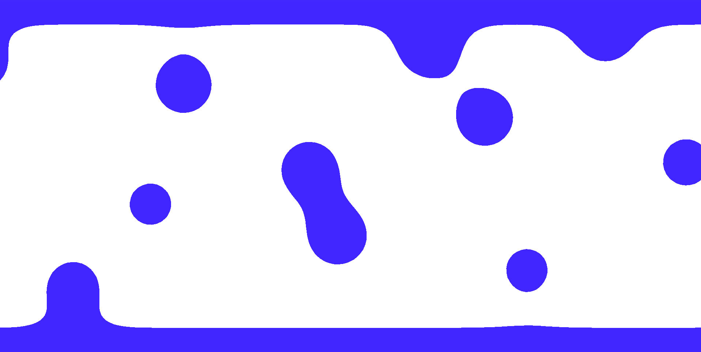

# 🌋 Lava Lamp Landing Page

A full-screen lava lamp effect created with React.js and Tailwind CSS to be
used in a landing page or any large area. The trick uses a CSS filter to blur
adjacent HTML elements, merging them into one another. Then, using another CSS
filter to sharpen all of the edges to make clearly defined blobs. Animating
these HTML elements results in the appearance of lava lamp globules gliding
past one another and merging with each other as they do.

